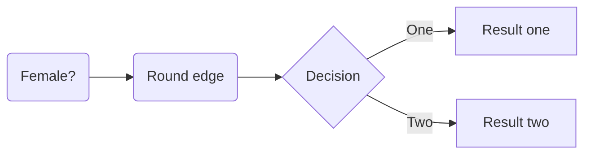

# QuestMLProblemSets
Problem set answers for Fall Block 1 Machine Learning course at Quest University Canada

## Problem Set 2:
We have the code along with the final plot output of a single run, with the line ax_1+bx_2+c=0, where (using variable finder) we see that the weights are,

a = -0.0065419563183276574  
b = -0.0071808969876720526  
c = 0.007811730018380093

## Problem Set 3:
### k Nearest Neighbour:  
Letting k=2 and with the points (0.8, 0.2), (0.55,02), (0.2, 0.4) we get them classified as 0, 0, 1 respectively.

### Decision Trees:
I used the old titanic_medium dataset here to code a decision tree that is able to find two levels. It is able to give a tree that has the structure:

